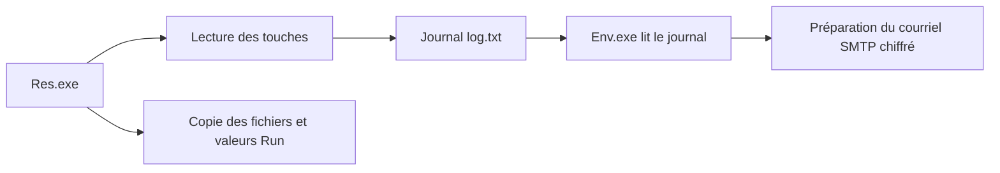

# US 3 — Analyse statique

**Analyse du 10 septembre 2026 — US 3 validée.**

L’examen du code identifie deux composants complémentaires : `Res.exe` contient la collecte des touches et l’installation persistante ; `Env.exe` lit le journal et prépare son envoi par SMTP chiffré. Ces conclusions reposent sur les fichiers du laboratoire, leurs imports et leur désassemblage.

## Objectif et méthode

Comprendre les fonctions principales sans exécuter le malware, analyser ses chaînes, imports et sections, puis extraire des indicateurs de compromission.

Les deux EXE proviennent du [dépôt Waelmeg/Malware, commit figé](https://github.com/Waelmeg/Malware/tree/056490ff588f3191a9edef6353d89c85398e7fca). Leurs SHA-256 recalculés correspondent à ceux de l’US 2.

Les outils sont construits dans une image Debian, avant de monter l’échantillon. L’analyse utilise ensuite un conteneur sans réseau, sans privilèges supplémentaires et avec une racine en lecture seule. L’archive est montée en lecture seule ; les copies temporaires des EXE restent dans un `tmpfs` marqué `noexec`, supprimé avec le conteneur. Seuls les résultats textuels sont écrits dans le projet. La VM Windows est restée arrêtée pendant cette US.

Outils exécutés : **pefile 2024.8.26** pour lire le format PE et **GNU objdump 2.44** pour désassembler le code x86. Aucun débogage ni nouvel essai dynamique n’a été réalisé ici.

## 1. Structure des fichiers

| Propriété | Res.exe | Env.exe |
| --- | --- | --- |
| Taille | 25 088 octets | 53 248 octets |
| Architecture | PE32, x86, machine `0x14c` | PE32, x86, machine `0x14c` |
| Base d’image préférée | `0x400000` | `0x400000` |
| Point d’entrée PE | `0x4014e0` | `0x4014c0` |
| Sections | 8 | 8 |
| Bibliothèques importées | 7 | 8 |
| Entrées d’import, fonctions et données confondues | 100 | 232 |
| Table de certificats intégrée | Taille nulle | Taille nulle |
| Données ajoutées après les sections, ou overlay | Aucun détecté par pefile | Aucun détecté par pefile |
| Horodatage de l’en-tête, UTC | 22/12/2017 12:02:53 | 22/12/2017 00:40:43 |

L’horodatage PE est modifiable : il ne prouve ni la date réelle de compilation ni celle d’une infection. Une table de certificats vide indique l’absence de signature intégrée à cet emplacement ; nous n’avons pas vérifié d’éventuelle signature par catalogue.

| Section | Rôle habituel | Droits | Taille sur disque Res / Env | Entropie Res / Env |
| --- | --- | --- | ---: | ---: |
| `.text` | Instructions machine | RX | 10 240 / 28 160 | 5,982 / 5,941 |
| `.data` | Données initialisées modifiables | RW | 512 / 512 | 0,951 / 0,838 |
| `.rdata` | Constantes, chaînes, tables C++ | R | 4 608 / 6 144 | 5,233 / 5,082 |
| `.eh_fram` | Informations de gestion des exceptions | R | 3 584 / 4 608 | 4,564 / 4,522 |
| `.bss` | Données réservées en mémoire | RW | 0 / 0 | Sans données sur disque |
| `.idata` | Imports et tables associées | RW | 4 096 / 11 776 | 5,283 / 5,506 |
| `.CRT` | Initialisation du runtime C/C++ | RW | 512 / 512 | 0,255 / 0,255 |
| `.tls` | Données locales aux threads | RW | 512 / 512 | 0,204 / 0,205 |

R signifie lecture, W écriture, X exécution. Aucun de ces en-têtes de section ne déclare simultanément W et X. Le code et de nombreuses chaînes sont directement lisibles. Aucun empaquetage évident n’a été identifié avec ces contrôles ; l’entropie seule ne permet pas d’exclure une protection ou une obfuscation partielle. Les notions d’adresses et de sections suivent la [spécification PE de Microsoft](https://learn.microsoft.com/en-us/windows/win32/debug/pe-format).

## 2. Imports : les capacités disponibles

Un import est une fonction ou une donnée que le programme demande à une bibliothèque. Sa présence ne prouve pas qu’un chemin d’exécution l’utilise. Nous avons donc suivi les références dans les instructions.

| Composant | Imports significatifs, noms C++ simplifiés | Ce qu’ils permettent d’examiner |
| --- | --- | --- |
| Res.exe — USER32 | `GetAsyncKeyState`, `GetKeyState`, `ShowWindow` | État des touches et visibilité de la console |
| Res.exe — Qt5Core | `QSettings`, `QSettings::setValue` | Écriture de paramètres, notamment dans le registre Windows |
| Res.exe — msvcrt | `system` | Exécution des commandes de création de dossiers et de copie |
| Res.exe — libstdc++ | `std::thread`, ouverture de fichiers, insertion dans un flux | Boucle de collecte et écriture du journal |
| Env.exe — libstdc++ | Ouverture de fichiers, `std::getline` | Lecture du journal |
| Env.exe — Qt5Network | `QSslSocket::connectToHostEncrypted`, `waitForEncrypted` | Connexion réseau chiffrée |
| Env.exe — Qt5Core | `QTextStream`, `QByteArray::toBase64` | Écriture du dialogue SMTP et encodage des données d’authentification |
| Env.exe — Qt5Widgets | `QApplication`, `QMainWindow`, `QLineEdit` | Interface graphique Qt |

Les noms exacts et les adresses IAT figurent dans [analyse.json](resultats/analyse.json). Les imports habituels du runtime, comme `VirtualProtect` ou `LoadLibraryA`, ne suffisent pas à conclure à une injection ou à une évasion.

## 3. Fonctions principales identifiées dans le code

Les adresses ci-dessous sont des **adresses virtuelles statiques**, calculées avec la base préférée `0x400000`. Elles peuvent différer des adresses observées après chargement. Les intitulés des fonctions sont des descriptions attribuées pendant l’analyse, pas des noms de source retrouvés.

### Res.exe : collecte et persistance

| Fonction / bloc | Preuve dans le désassemblage | Interprétation |
| --- | --- | --- |
| Organisation principale, `0x4035a0` | `0x403603` transmet `0x401640` au constructeur de thread ; appel à `0x403480`, puis à `0x401aa0` en `0x403612` | Démarre la collecte dans un thread, puis réalise l’installation |
| Boucle de collecte, `0x401640` | `Sleep(10)` en `0x40165e`, balayage des codes de touche de `0x08` à `0xbe`, appel IAT en `0x40167e` | Interroge régulièrement l’état du clavier |
| Écriture du journal | Le chemin à `0x405064` est passé à l’ouverture de fichier en `0x401791` ; écritures de caractères en `0x40182f` et `0x401989` | Ajoute les caractères ou représentations de touches à `C:\WindSyst\log.txt` |
| Traduction des touches, `0x401fb0` et `0x401ed0` | Appels à `GetKeyState` en `0x402017` et à `GetAsyncKeyState` en `0x402029` ; traitement de codes spéciaux | Tient compte notamment de Majuscule et Verr. majuscule pour produire du texte |
| Installation, `0x401aa0` | `GetConsoleWindow` en `0x401aac`, puis `ShowWindow` avec le paramètre zéro en `0x401abd` | Prévoit de masquer la console |
| Copie des fichiers | Commandes `mkdir` et `XCOPY` passées à `0x4031dc`, un relais vers l’import `system` | Prévoit la création de `C:\WindSyst` et la copie des EXE et DLL |
| Persistance | Chemin de registre à `0x405294` ; appels à `QSettings::setValue` en `0x401c12` et `0x401cb8` | Écrit les valeurs `Res` et `Env` dans la clé Run de l’utilisateur |

**Comment prouver l’appel à GetAsyncKeyState ?**

1. `pefile` rattache le nom `GetAsyncKeyState` à `USER32.dll`, avec une entrée IAT à `0x409368`.
2. Le désassemblage contient l’instruction suivante :

```asm
40167b: mov  DWORD PTR [esp],ebx
40167e: call DWORD PTR ds:0x409368
401687: cmp  ax,0x8001
```

3. `ebx` porte le code de touche balayé par la boucle. Le résultat de l’appel conditionne la suite du traitement.

Nous avons donc une référence à une fonction importée **et une instruction qui l’appelle**, au-delà d’une simple chaîne de caractères. Cela démontre la logique de collecte dans le code ; la qualité des touches réellement enregistrées reste une question dynamique. Le test exact contre `0x8001` dépend notamment du bit faible que [Microsoft décrit comme non fiable](https://learn.microsoft.com/en-us/windows/win32/api/winuser/nf-winuser-getasynckeystate).

Les appels à `QSettings` utilisent le format natif de Windows, qui permet l’accès au registre, conformément à la [documentation Qt](https://doc.qt.io/archives/qt-5.15/qsettings.html#accessing-the-windows-registry-directly). Les valeurs construites sont :

| Clé | Nom de valeur | Donnée |
| --- | --- | --- |
| `HKCU\Software\Microsoft\Windows\CurrentVersion\Run` | `Res` | `C:\WindSyst\Res.exe` |
| Même clé | `Env` | `C:\WindSyst\Env.exe` |

Cette clé sert à lancer des programmes à l’ouverture de session ; la réussite de l’écriture et du lancement n’est pas prouvée par le seul code. Voir les [clés Run et RunOnce de Microsoft](https://learn.microsoft.com/en-us/windows/win32/setupapi/run-and-runonce-registry-keys).

### Env.exe : lecture du journal et préparation d’un envoi

| Fonction / bloc | Preuve dans le désassemblage | Interprétation |
| --- | --- | --- |
| Initialisation, `0x401630` puis `0x401e30` | Appel à `0x4016b0` dans le constructeur, en `0x401e7c` | Le chemin de lecture et d’envoi est appelé dès la construction de la fenêtre |
| Lecture, `0x4016b0` | Chemin `log.txt` à `0x4090e6`, ouverture en `0x4017cb`, `std::getline` en `0x40180f` | Lit le journal ligne par ligne et en rassemble le texte |
| Configuration SMTP | Chaîne `smtp.laposte.net` à `0x40911f`, chargée en `0x401900` ; port `0x1d1`, soit 465, en `0x40192f` | Prépare ce serveur et ce port pour le composant SMTP construit en `0x40195c` |
| Préparation du courriel, `0x402070` | Appel en `0x401a6a` avec le texte lu ; ajout de cet argument au message en `0x4022ea` | Place le journal dans le corps du message |
| Connexion chiffrée | Hôte et port stockés dans le constructeur `0x401f40`, puis passés à l’import `QSslSocket::connectToHostEncrypted` en `0x40243d` | Le chemin prévoit une connexion SMTP sur une socket chiffrée |
| Dialogue SMTP | Références à `EHLO`, `AUTH LOGIN`, `MAIL FROM`, `RCPT TO` et `DATA` ; écriture du message préparé en `0x40452e` | Contient la logique d’authentification et de transmission du courriel |

La signification de `connectToHostEncrypted` est documentée par [Qt](https://doc.qt.io/archives/qt-5.15/qsslsocket.html#connectToHostEncrypted). Le code contient aussi des valeurs fixes pour l’authentification et des adresses de messagerie. Ces données ne sont pas publiées dans les résultats textuels.

**Distinction entre les deux domaines :** `smtp.gmail.com` est référencé dans la construction de l’interface, en `0x406f54`. Le chemin automatique analysé prépare `smtp.laposte.net:465`. Une recherche de chaînes seule n’aurait pas permis de les distinguer.

L’analyse statique établit une capacité d’exfiltration du journal par courriel. Elle ne prouve ni une connexion réussie, ni une authentification valide, ni la réception d’un message.



## 4. Chaînes et indicateurs de compromission

Les chaînes sélectionnées sont enregistrées avec leur encodage, leur offset dans le fichier et leur adresse virtuelle. La sélection couvre les chemins, commandes de copie, valeurs Run et éléments SMTP ; ce n’est pas un relevé exhaustif de toutes les chaînes.

| Indicateur | Source statique | Utilité et limite |
| --- | --- | --- |
| SHA-256 des deux EXE | Calcul sur leurs octets, recoupé avec l’US 2 | Identification précise de ces fichiers ; une modification change le hash |
| `C:\WindSyst\Res.exe` et `C:\WindSyst\Env.exe` | Chaînes à `0x4052d4` et `0x4052ec` dans Res.exe | Chemins d’installation et cibles de persistance |
| `C:\WindSyst\log.txt` | Res.exe `0x405064` ; Env.exe `0x4090e6` | Fichier reliant la collecte et l’envoi |
| Clé Run + valeur `Res` ou `Env` + chemin correspondant | Arguments des appels à `QSettings::setValue` | Combinaison utile pour rechercher la persistance ; la clé Run seule est légitime |
| `smtp.laposte.net:465` | Argument suivi jusqu’au chemin de connexion | Destination configurée ; service légitime, pas un indicateur suffisant à lui seul |
| `smtp.gmail.com` | Chaîne utilisée par l’interface | Indice de contexte seulement ; pas la destination du chemin automatique étudié |

La liste structurée, les empreintes complètes et les références sont dans [iocs.csv](iocs.csv). Aucun domaine de messagerie n’est qualifié de malveillant sur la seule base de sa présence dans ce fichier.

## 5. Reproduire et présenter l’analyse

Depuis le projet, avec Docker Desktop lancé et le volume d’échantillons de l’US 1 présent :

```bash
bash us3/analyse.sh
```

Le script construit les outils puis relance l’analyse. Le premier lancement télécharge l’image et les paquets ; le conteneur qui lit le malware n’a pas de réseau. Il actualise uniquement les résultats automatiques ; le présent rendu et les IOC sont une synthèse humaine des résultats.

- [analyse.py](analyse.py) : lecture des deux PE et lancement du désassembleur, sans arguments.
- [analyse.json](resultats/analyse.json) : hashes, sections, imports, chaînes sélectionnées et versions des outils.
- [Res.exe.asm.txt](resultats/Res.exe.asm.txt) et [Env.exe.asm.txt](resultats/Env.exe.asm.txt) : désassemblages complets des sections exécutables, sous forme de texte.

Pour la démonstration, commencer par la preuve `0x40167e` : retrouver l’adresse IAT dans le JSON, puis l’instruction `call` dans le désassemblage. Montrer ensuite le chemin commun du journal et les deux valeurs Run. Terminer par la différence entre le serveur de l’interface et celui du chemin automatique.

## 6. Validation de l’US 3

- [x] Fonctions principales identifiées et reliées à des instructions du binaire.
- [x] Sections, permissions, entropies, imports et chaînes analysés.
- [x] Indicateurs extraits, avec leur provenance et leurs limites.

Les critères de l’US 3 sont remplis. L’US 4 devra confronter ces capacités aux traces d’exécution : fichiers réellement créés, persistance effective, qualité du journal et comportement d’Env.exe. La collecte et l’envoi ne doivent pas être présentés comme entièrement fonctionnels sur la seule base de cette analyse statique.
