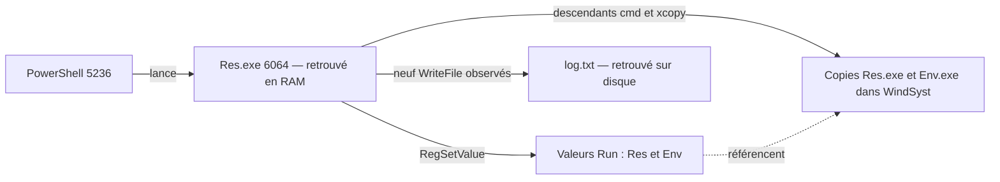

# US 8 — Analyse croisée RAM / disque

**Analyse du 10 septembre 2026. Les deux critères de l’US 8 sont validés.**

Le processus **`Res.exe`, PID 6064**, retrouvé en mémoire, correspond au programme lancé depuis `C:\Lab\sample\virus\Res.exe`. La trace d’exécution relie ce processus aux copies de fichiers dans `C:\WindSyst` et aux deux valeurs de démarrage automatique **`Run\Res` et `Run\Env`** retrouvées dans la ruche du compte Analyste.

La **persistance est configurée**. Son déclenchement lors d’une nouvelle ouverture de session n’a pas été testé. `Env.exe` est présent sur disque et référencé dans le registre, mais aucun processus `Env.exe` n’est retrouvé dans les captures RAM examinées.

## 1. Périmètre et preuves utilisées

L’US 8, page 14 du backlog, demande de corréler les données mémoire et disque pour reconstruire un scénario d’attaque cohérent. L’analyse porte sur le **premier essai du laboratoire**.

| Source | Utilisation dans cette US |
|---|---|
| [Résultats mémoire de l’US 6](../us6/rendu.md) | Réutilisation des sorties `pslist`, `psscan`, `cmdline` et `dlllist` de Volatility 3, version 2.28.0. |
| [Image RAW de l’US 7](../us7/rendu.md), snapshot `malware-first-run` | Nouveau contrôle SHA-256 intégral des 64 Gio ; relecture des quatre EXE, du journal, de la ruche et de la trace PML. |
| Snapshot `windows-clean-us1` | Nouvelle lecture de la même clé Run dans la ruche utilisateur avant l’essai. |
| [Premier relevé Process Monitor de l’US 4](../us4/resultats/evenements.csv) | Sélection des événements reliant le lancement, les copies, les écritures du registre et celles du journal. |

L’empreinte de l’image RAW reste :

```text
9b0b50283470c02c0a26ec6af766f85c40589fb447d33395bed392b5c06e70a4
```

La trace `C:\Lab\trace.pml`, relue dans l’image, conserve le SHA-256 `0853884c7af540bab2252ac4491070614d0851909804555252be073d24be5bae`, correspondant au premier essai. Les événements sont repris de son export US 4 ; ils ne proviennent pas d’une nouvelle exécution. Les empreintes des fichiers et des résultats réutilisés sont consignées dans [provenance.json](resultats/provenance.json).

La RAM après lancement a été acquise vers **12:37 UTC, horloge hôte** ; le snapshot disque date de **12:50:44 UTC, horloge hôte**. Ce sont deux instants de la même séance. Les heures des processus et de Process Monitor ci-dessous sont celles de **Windows**, conservées telles quelles ; elles ne sont pas mélangées avec l’horloge hôte.

## 2. Correspondance entre mémoire et fichiers disque

| Élément | Mémoire | Disque et trace | Conclusion |
|---|---|---|---|
| **`Res.exe` lancé** | PID **6064**, parent **5236 — PowerShell**, création **10:33:34**, deux threads, aucune date de sortie. Absent de la liste avant l’essai. | La ligne de commande et le module chargé désignent `C:\Lab\sample\virus\Res.exe`. Le fichier existe sur l’image RAW. L’événement **100806** confirme le même lancement, parent et heure. | Correspondance étayée entre le processus actif et le chemin du fichier lancé. |
| **Copie de `Res.exe`** | Le chemin de lancement retrouvé en RAM reste celui du dossier de test. | `C:\WindSyst\Res.exe` a le même SHA-256 que l’original. L’événement **120877** montre son écriture par `xcopy.exe`, descendant du PID 6064. | Copie installée sur disque ; la capture ne montre pas un second `Res.exe` lancé depuis ce chemin. |
| **`Env.exe`** | Aucun processus trouvé dans les listes avant/après ni dans le scan après. | Présent dans le dossier de test et dans `C:\WindSyst`, avec des empreintes identiques. Copie observée à l’événement **123465**. | Composant installé, dont l’exécution n’est pas démontrée par ces captures mémoire. |
| **`log.txt`** | Le PID 6064 est encore actif dans le dump après lancement. | Neuf écritures réussies d’un octet par ce PID dans la trace ; journal final de **82 octets** sur l’image disque. | La trace relie le processus retrouvé en RAM au journal présent sur disque. |

Les deux lignes `Res.exe` de `dlllist` ont le même PID, le même chemin et la même base `0x400000` ; elles ne sont pas comptées comme deux processus. La comparaison des chemins tient compte de la casse et des séparateurs Windows. Les valeurs originales restent disponibles dans les résultats US 6.

Les [corrélations détaillées](resultats/correlations.json) conservent les champs mémoire et les fichiers correspondants. L’identité des copies **sur disque** est confirmée par leurs empreintes :

```text
Res.exe : 49f091ade48890bfa22d2b455494be95e52392c478b67e10626222b6aee37e1e
Env.exe : e09ec2098363a129de143fdaf73ad6e2e61266fba3f638a25214af3a8bc8f2f2
```

La correspondance RAM/disque s’appuie sur le chemin, le PID, le parent, l’heure de création et la trace d’exécution. **Aucune empreinte du code exécutable extrait de la RAM n’a été calculée** : cette analyse ne démontre pas l’identité octet par octet du code en mémoire avec le fichier, ni l’absence d’une modification en mémoire.

## 3. Détection de la persistance

La ruche `C:\Users\Analyste\NTUSER.DAT` a été lue directement dans l’image RAW, puis comparée à celle du snapshot propre. La clé examinée est :

```text
HKCU\Software\Microsoft\Windows\CurrentVersion\Run
```

| Valeur | État propre | Disque après essai | Auteur observé dans Process Monitor |
|---|---|---|---|
| **`Res`**, type `REG_SZ` | Absente | `C:\WindSyst\Res.exe`, fichier présent et identifié | **PID 6064**, événement **142639**, `RegSetValue` réussi à **10:33:45.650713** |
| **`Env`**, type `REG_SZ` | Absente | `C:\WindSyst\Env.exe`, fichier présent et identifié | **PID 6064**, événement **142667**, `RegSetValue` réussi à **10:33:45.656706** |

Ces constats se renforcent : les valeurs apparaissent après l’essai, leurs cibles existent et la trace attribue les écritures à `Res.exe`. Les données et types relus dans la ruche correspondent aux écritures enregistrées. La [preuve de persistance](resultats/persistance.json) contient les valeurs avant/après, les empreintes des ruches, les fichiers cibles et les événements associés.

Les valeurs d’une clé `Run` demandent le lancement des programmes à chaque ouverture de session du compte concerné. Windows peut différer ce lancement et ne garantit pas l’ordre des programmes. Voir la [documentation Microsoft sur Run et RunOnce](https://learn.microsoft.com/en-us/windows/win32/setupapi/run-and-runonce-registry-keys).

La conclusion est donc **un mécanisme de persistance installé pour le compte Analyste**. La réussite d’un prochain lancement automatique, ainsi que le bon fonctionnement de chaque programme lancé, restent à distinguer de cette configuration. Aucune nouvelle ouverture de session n’a été effectuée dans cette US.

## 4. Scénario reconstitué

Les heures suivantes proviennent de l’horloge Windows du premier essai :

| Heure | Étape | Preuve |
|---|---|---|
| **10:33:34.519863** | L’analyste lance `Res.exe` depuis PowerShell ; PID 6064, parent 5236. | Événement **100806**, cohérent avec `pslist` et `cmdline`. |
| **10:33:40.302037** | Copie de `Res.exe` dans `C:\WindSyst`. | Événement **120877** ; filiation **Res 6064 → cmd 3104 → xcopy 4452**. |
| **10:33:40.923890** | Copie d’`Env.exe` dans `C:\WindSyst`. | Événement **123465** ; filiation **Res 6064 → cmd 4752 → xcopy 5548**. |
| **10:33:45.650713 à 10:33:45.656706** | Écriture des deux valeurs de démarrage automatique. | Événements **142639** et **142667**, confirmés dans la ruche disque. |
| **10:34:02.714294 à 10:35:44.955481** | Neuf écritures d’un octet dans `log.txt`. | Événements **155195 à 210754**, non consécutifs. |
| **10:36:59**, valeur `SystemTime` du dump | `Res.exe` est toujours actif dans la capture RAM. | [Informations mémoire](../us6/resultats/apres-info.json) et [liste des processus](../us6/resultats/apres-pslist.json). |

La sélection des **14 événements** est disponible dans [evenements.csv](resultats/evenements.csv). Le [résumé du scénario](resultats/scenario.json) conserve également les filiations des processus de copie.



Les neuf octets écrits dans la fenêtre Process Monitor et les 82 octets du fichier final se rapportent à des instants différents. La trace s’arrête avant le snapshot disque : ces deux nombres ne sont pas présentés comme la quantité totale de données collectées pendant l’essai.

Le scénario observé couvre le lancement volontaire dans le laboratoire, l’installation locale, la configuration de persistance et les écritures du journal. Le vecteur d’infection d’un poste réel n’est pas établi. Aucun envoi SMTP réussi n’est démontré ; les résultats réseau de l’US 6 ne montrent aucune connexion suspecte dans les structures examinées.

## 5. Reproduction et validation

Depuis la racine du projet, avec Docker démarré :

```bash
bash us8/analyse.sh
```

Le script ne prend aucun argument. Il recalcule l’empreinte de l’image complète, relit les fichiers et les deux ruches, puis produit les corrélations et le scénario. Il s’appuie sur les preuves du premier essai conservées dans les US 4, 6 et 7. Les sources sont montées en lecture seule et l’analyse s’exécute dans un conteneur sans réseau. La VM est restée arrêtée ; son [état](resultats/etat-vm.json) est conservé.

- [x] **Correspondance entre processus mémoire et fichiers disque** : `Res.exe` relié au fichier lancé et aux copies installées, avec les limites d’identification précisées. La présence d’`Env.exe` sur disque est distinguée de son absence dans les résultats mémoire.
- [x] **Détection d’éventuelle persistance** : deux valeurs Run absentes de l’état propre, présentes après l’essai, pointant vers les fichiers identifiés et attribuées à `Res.exe` par la trace.

Pour la démonstration, partir du PID 6064 en RAM, retrouver son chemin dans l’image disque, suivre la copie vers `WindSyst`, puis montrer les deux valeurs Run avant/après et leurs événements d’écriture.
